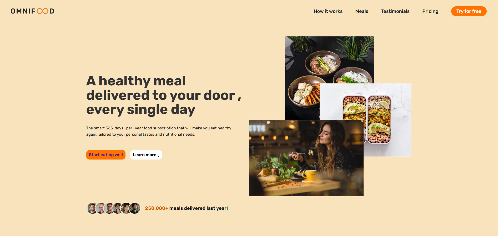
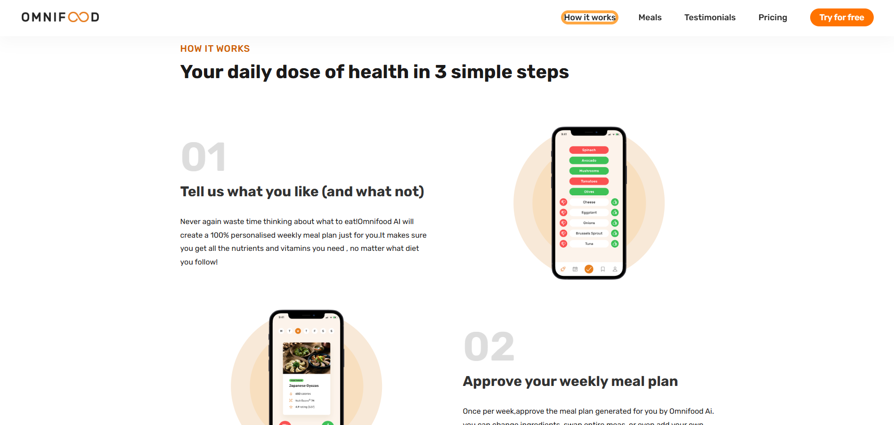
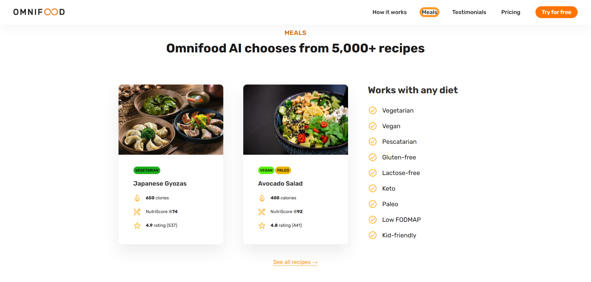
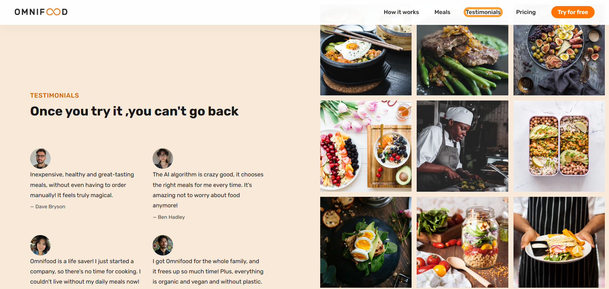
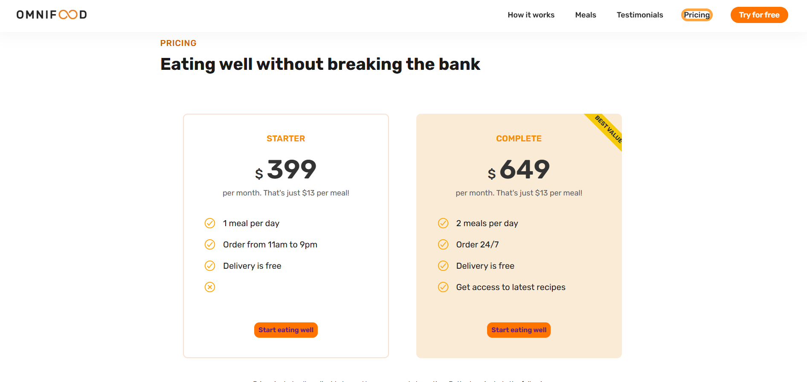
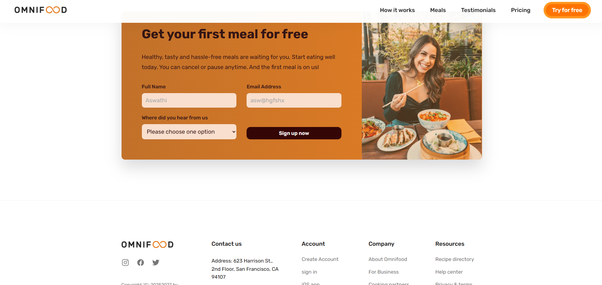

# Omnifood 🍽️

Omnifood is a modern, responsive food subscription landing page that showcases a fictional AI-powered meal delivery service. It highlights the features, pricing, testimonials, and benefits of the service with an elegant design.

## 🌟 Live Preview

> (Optional: Add your live project link here)

## 📸 Screenshots








## 💻 Tech Stack

- **HTML5**
- **CSS3 (Flexbox + Grid)**
- **JavaScript (basic interactivity if applicable)**
- Responsive design using **media queries**

## 🚀 Features

- 🔥 Responsive design optimized for all devices
- 🎯 Clean UI with CTA buttons
- 🥗 Meal section with dietary filters
- 🧠 AI-based personalized meal planning (concept)
- 💬 Testimonials with real-looking reviews
- 💰 Transparent and affordable pricing plans
- ✍️ Functional form with input validation styles

## 📁 Folder Structure

omnifood/
├── index.html
├── css/
│ └── style.css
├── js/
│ └── script.js (if used)
├── images/
│ └── [All images used]
├── screenshots/
│ └── [Project screenshots for README]
└── README.md

bash
Copy
Edit

## 📦 How to Use

1. Clone this repo:
   ```bash
   git clone https://github.com/yourusername/omnifood.git
   Open index.html in your browser.
   ```

Customize as needed for your own projects.

🧠 Inspiration
This project was inspired by real-world product landing pages and built to practice layout, responsiveness, and visual design skills.
